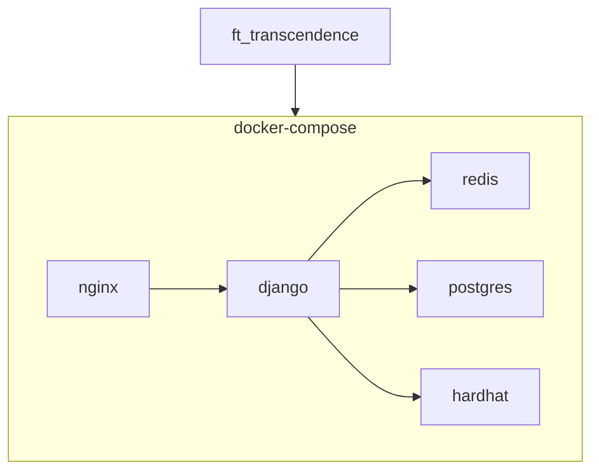

# ft_transcendence

## 프로젝트 소개
-------------------

<blockquote>Real-time Multiplayer Pong Game with OAuth, Blockchain, 2FA and JWT</blockquote>
 

## 개발 기간
- 2024.03.30 ~ 2024.07.11
- 2024.03.30 start
- 2024.06.04 team building
- 2024.07.07 1st try(failed)
- 2024.07.11 passed

## 개발 환경
- Frontend: JavaScript
- Backend: Python, Django
- DataBase: Redis, postgresql
- Blockchain: solidity
- Docker
- nginx

## 개발자 소개 및 역할
- ⭐ 복준석(jbok): Backend, Frontend, DevOps
- 강민관(mingkang): Backend, Design
- 도준웅(jdoh): Frontend
- 송선우(sunwsong): Backend, Blockchain
- 이창현(changhyl): Frontend

*******************
## 프로젝트 구조
-------------------
컨테이너 구조

## 환경 세팅

- `npm install ..??`  
- `make`

## Views
페이지 view 입니다
### Tournament
### Main page
### 1 vs 1
### 1 vs 1 vs 1 vs 1