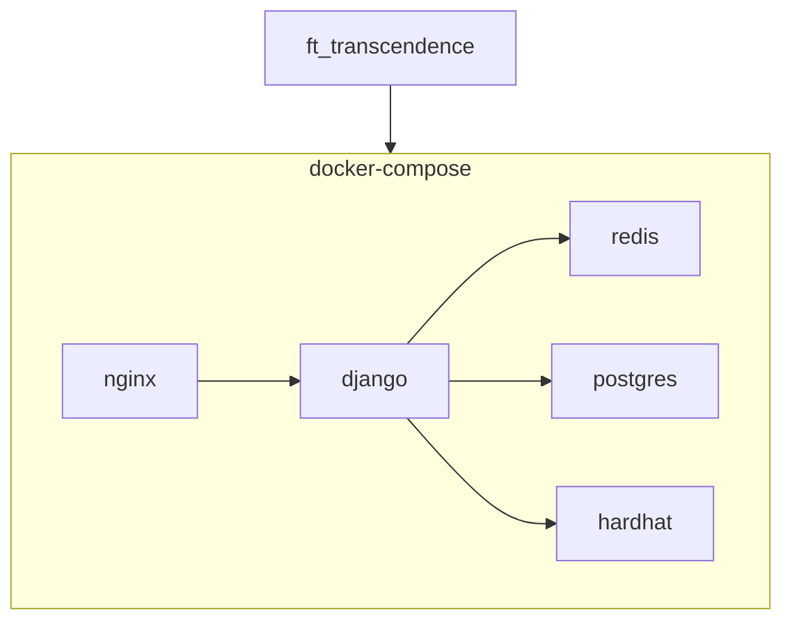

# ft_transcendence

### 프로젝트 소개
-------------------
대충 설명
*******************
### 프로젝트 구조
-------------------
컨테이너 구조

```mermaid
graph TB;
    A[ft_transcendence]
    subgraph docker-compose
        direction LR
        B[nginx]
        C[django]
        D[redis]
        E[postgres]
        F[hardhat]
    end

    A --> docker-compose
    B --> C
    C --> D
    C --> E
    C --> F
```