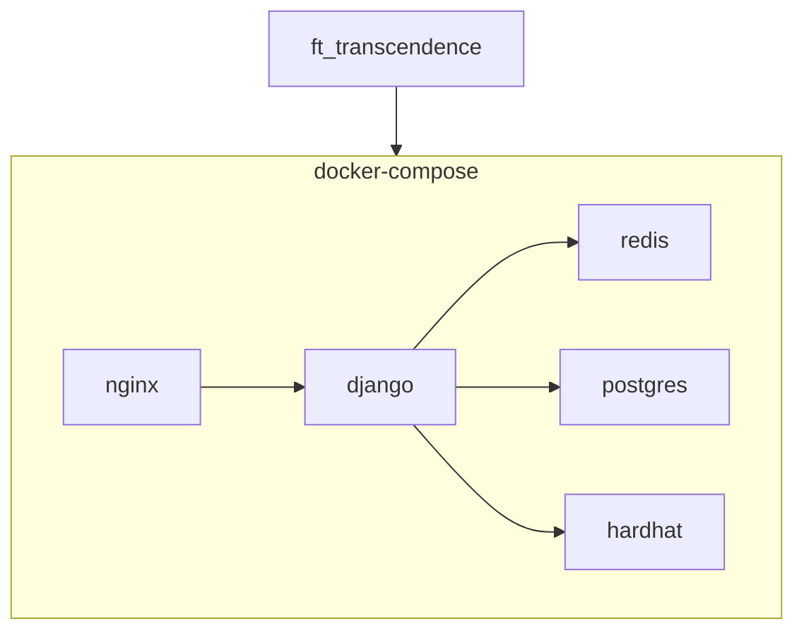

# 🏓 ft_transcendence - 탁구 게임 웹 서비스

## 💬 프로젝트 소개
-------------------

<blockquote>Real-time Multiplayer Pong Game with OAuth, Blockchain, 2FA and JWT</blockquote>
 

- 웹소켓을 기반으로 한 탁구 게임 서비스로 원격 환경에서 플레이 가능합니다.  
- 똑똑한 AI 봇을 상대로 즐길 수 있습니다.  
- 토너먼트 기능을 통해 여러 사용자와 함께 토너먼트 대진으로 플레이 가능합니다.  
- 친구들과 2:2 팀 게임 진행이 가능합니다.  
- 같은 PC로도 친구들과 탁구 게임을 즐길 수 있습니다.  

## 🖥️ 개발 기간
- 2024.03.30 ~ 2024.07.11
- 2024.03.30 start
- 2024.06.04 team building
- 2024.07.07 1st try(failed)
- 2024.07.11 passed

## ⚙️ 개발 환경
- Frontend: JavaScript
- Backend: Python, Django
- DataBase: Redis, postgresql
- Blockchain: solidity
- Docker
- nginx

## 🧑‍🤝‍🧑 개발자 소개 및 역할
- ⭐ 복준석(jbok): Backend, Frontend, DevOps
- 강민관(mingkang): Backend, Design
- 도준웅(jdoh): Frontend
- 송선우(sunwsong): Backend, Blockchain
- 이창현(changhyl): Frontend

*******************
## ⛩️ 프로젝트 구조
-------------------
컨테이너 구조

